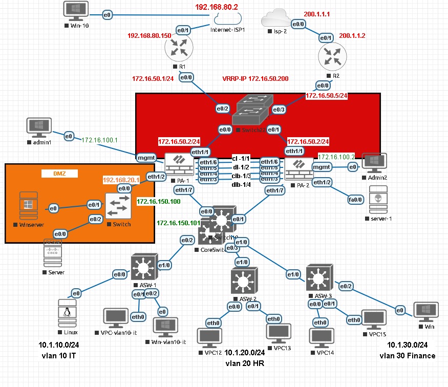

Palo Alto HA Firewall Lab

Platform: PAN-OS 10.2 (Palo Alto VM), deployed in EVE-NG

This lab implements a three-tier hierarchical enterprise network design (collapsed core), with a redundant dual-ISP edge and a firewall-based security perimeter:

Edge layer: Two routers (R1, R2), each connected to a separate ISP, providing WAN redundancy.
Perimeter layer: An Active/Passive Palo Alto HA pair (PA-1/PA-2) acting as the security boundary between the edge and the internal network, with a dedicated DMZ segment for externally-facing services.
Core/access layer: A core switch distributing to three access switches, each hosting a dedicated VLAN (IT, HR, Finance) — a star topology fanning out from a single collapsed core.
Management plane: A separate, isolated management network for out-of-band administrative access to the firewalls.
WAN Edge Redundancy (VRRP)

R1 and R2 each connect to a different ISP and share a virtual gateway IP via VRRP, so internal traffic always has a reachable default gateway even if one router or ISP link fails.

interface e0/0
  ip address 172.16.50.1 255.255.255.248
  vrrp 10 ip 172.16.50.200
  vrrp 10 priority 120
  vrrp 10 preempt
Virtual/shared gateway IP: 172.16.50.200
R1: 172.16.50.1/24 (priority 120, preempt enabled)
R2: 172.16.50.5/24 (standby peer)
HA Configuration (Active/Passive)

The Palo Alto pair uses dedicated, isolated links for HA control and data synchronization, separate from production traffic:

Link	Interface	Purpose
Control link (primary)	eth1/3	HA1 — 192.168.1.1/2
Control link (backup)	eth1/5	HA2 backup — 192.168.2.1/2
Data link (primary)	eth1/4	Session sync
Data link (backup)	eth1/6	Session sync (backup)

Setup steps followed:

Dedicate interfaces eth1/3–eth1/6 on both firewalls exclusively to HA (no production traffic on these links).
Enable HA under Device > High Availability > General, and configure the peer IP for each HA interface (e.g. 192.168.1.2 for eth1/3, 192.168.2.2 for eth1/5).
Configure election settings under Device > High Availability > Election — the firewall with the lower priority number becomes the active/root peer; preempt is enabled so the designated primary reclaims active status after recovery.
Configure the control and data links under Device > High Availability > HA Communications, assigning each interface its role (control/data, primary/backup) as shown above.
Management

Each firewall has a dedicated management interface on an isolated management subnet, separate from production and HA traffic:

set deviceconfig system type static
set deviceconfig system ip-address 172.16.100.1 netmask 255.255.255.0
set deviceconfig system hostname active
PA-1 management: 172.16.100.1
PA-2 management: 172.16.100.2
DMZ

A dedicated DMZ zone (192.168.20.0/24) hosts externally-reachable services (a Windows server and an additional server), isolated from internal VLANs and reachable only through explicit firewall policy.

Internal Network Segmentation
VLAN	Segment	Subnet
VLAN 10	IT	10.1.10.0/24
VLAN 20	HR	10.1.20.0/24
VLAN 30	Finance	10.1.30.0/24

Each VLAN connects through its own access switch (ASW-1/2/3) into the core switch, which uplinks to both firewalls (172.16.150.100 / .101) for HA-aware routing.

Routing

Static routes are configured on the virtual router to reach internal subnets through the core switch:

set network virtual-router default routing-table ip static-route to-10.1.10.0 destination 10.1.10.0/24 nexthop ip-address 172.16.150.101
Verification Commands Used
show session all filter source application ping
show session id 143

What I Tested

HA Failover
Shut down the active port on PA-1 (simulating a link/device failure) and monitored the HA dashboard on both firewalls. PA-2 correctly transitioned to the active role, and traffic continued passing through the firewall pair without loss of connectivity.

VLAN Connectivity
Pinged between endpoints on each VLAN (IT, HR, Finance) to verify reachability. Traffic was permitted as expected, and firewall traffic logs were reviewed to confirm the sessions were seen and processed correctly by the firewall.

Note: Inter-VLAN traffic was permitted in this lab configuration to validate routing and connectivity end-to-end. A production deployment would typically apply granular security policies to restrict inter-VLAN traffic based on business need (e.g., Finance isolated from general IT/HR access).
